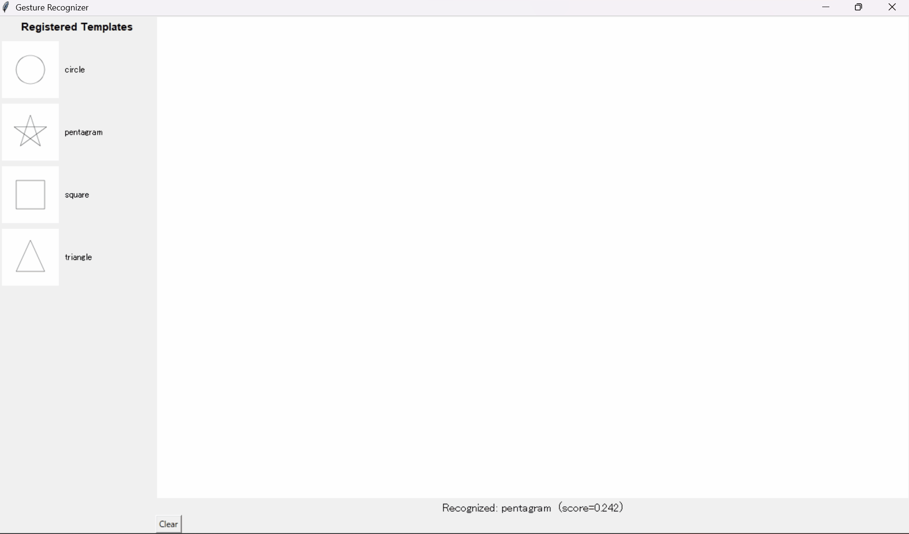

[English](README.md) | [日本語](README.ja.md)

# dolla_one_recognizer_python

A Python 3 implementation of the **$1 Unistroke Recognizer**.

[](https://pypi.org/project/dolla-one-recognizer-py/)
[](LICENSE)
[](https://www.python.org/)

> 詳しい日本語の解説は [README.ja.md](README.ja.md) にあります。

## What is this

The **$1 Unistroke Recognizer** is a lightweight single-stroke gesture recognition
algorithm by Wobbrock, Wilson, and Li (UIST '07). It needs no machine-learning
training: register just one template per shape and it works. It resamples the input
stroke to a fixed number of points, normalizes rotation, scale, and position, then
picks the nearest registered template.

Input is a plain list of points `[[x, y], ...]`, so the coordinates can come from a
mouse, touch input, or a tracker such as OpenCV optical flow / color / fingertip
tracking — just append each frame's `(x, y)` and pass the list in.

This repository contains the recognizer itself, packaged as `dolla_one_recognizer_py/`,
plus two small Tkinter demo apps: `export_gesture_app.py` (draw and save gesture
templates) and `recognize_app.py` (match a drawn stroke against saved templates).



## Install

```bash
pip install dolla-one-recognizer-py
```

This installs the recognizer itself (`dolla_one_recognizer_py`), depending only on `numpy`.

To also try the GUI demo apps (`export_gesture_app.py` / `recognize_app.py`), clone the
repo instead, which additionally installs `pillow` for PNG I/O:

```bash
git clone https://github.com/yuzujelly2222/dolla_one_recognizer_python.git
cd dolla_one_recognizer_python
pip install -r requirements.txt
```

## Usage

```python
from dolla_one_recognizer_py import dolla_one_recognizer

# Register templates — one example stroke per shape is enough
line_template = [[x, x] for x in range(0, 101, 5)]
check_template = [[0, 30], [30, 0], [90, 60]]

recognizer = dolla_one_recognizer(
    size=250,
    templates=[line_template, check_template],
    templates_name=["line", "checkmark"],
    n=64,
)

# Raw points to recognize (e.g. collected from a mouse drag)
query = [[x, x * 0.9 + 2] for x in range(0, 101, 4)]

best_points, best_name, score = recognizer.recognize(query)
print(best_name, score)  # -> line 0.96...
```

Try the GUI demos:

```bash
python export_gesture_app.py   # draw and save to gestures/ as CSV + PNG
python recognize_app.py        # auto-load gestures/ and test recognition
```

## How it works

$1 applies four steps to the input points and returns the nearest template:

1. **Resample** (`_resample`) to `n` (default 64) evenly spaced points, absorbing
   differences in drawing speed.
2. **Rotate** (`_rotate_to_zero`) so the angle from the centroid to the first point is zero.
3. **Scale & translate** (`_scale_to_square` -> `_translate_to_origin`) into a
   `size x size` square (default 250) centered at the origin.
4. **Match** (`recognize`) against each template, searching +/-45 degrees for the
   rotation that minimizes the average point-to-point distance (Golden Section Search),
   and return the closest. The distance is converted to a 0-1 score.

The Protractor enhancement (a closed-form optimal angle instead of the search) is not
included in this implementation. See [README.ja.md](README.ja.md) for a fuller walkthrough.

## API

Only the members below are part of the public API; the geometry helpers are prefixed
with `_` and are internal.

| Member | Description |
|---|---|
| `__init__(size, templates, templates_name, n)` | Initialize with a list of template strokes and their names |
| `add_template(points, name)` | Add one more template |
| `recognize(points)` | Normalize a raw stroke, match all templates, return `(best_points, best_name, score)` |

## License & citation

Distributed under the **New BSD License** — see [LICENSE](LICENSE).

This is an independent implementation based on the pseudocode from the paper below.
The original authors and copyright holders exist separately from this port.

> Wobbrock, J.O., Wilson, A.D. and Li, Y. (2007). Gestures without libraries, toolkits
> or training: A $1 recognizer for user interface prototypes. *Proceedings of the ACM
> Symposium on User Interface Software and Technology (UIST '07)*, pp. 159-168.

Official site (algorithm, pseudocode, reference implementation):
<https://depts.washington.edu/acelab/proj/dollar/index.html>
